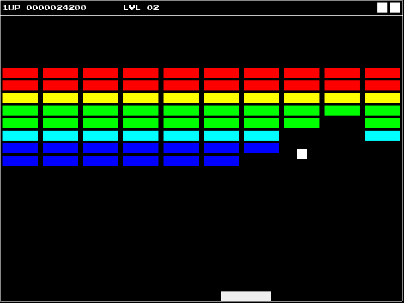

# BREAKOUT

I got back into hacking around with C while my classmates were
learning how to make breakout in JavaScript, so I decided to give this
a shot. My goal is to make the entire thing in less than 1,000 LOC and
only rely on SDL2.

## Acknowledgments

- [PressStart2P font by codeman38](http://www.fontspace.com/codeman38/press-start-2p)

## Directions

`A`,`D` and left/right arrow keys controls the paddle. `Q` quits the game.

If cheating is enabled (check `config.h`), clicking will position the ball
to the mouse pointer, and `W` simulates winning the game.

## Compiling and Installing

Make commands include `all` (default), `clean`, `install`, and
`uninstall`.

`config.mk` stores common settings for customizing building the
program. I've set `CC` to `clang`, but you might set it as something
else if you don't like `clang`.

`PREFIX` is set to be `~/.local`. For global installation, set it to
`/usr/local`.

## Hacking

Common variables and settings are stored in `config.h`. I really like
this file, so please treat it well :).

The code has four-space indents (no tabs!), curly braces in function
definitions have their own line, and any code block less significant
doesn't. Line width is ideally at 80 cols, but I break the rule
depending on how awkward the line of code is.
